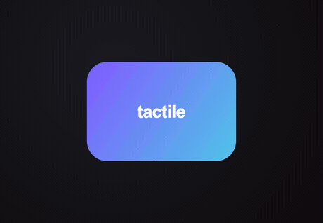

# tactile

[](https://pub.dev/packages/tactile)
[](https://pub.dev/packages/tactile/score)
[](LICENSE)
[](https://github.com/ananmouaz/tactile/actions/workflows/ci.yml)

**Make any Flutter widget feel physical when you touch it.** It tilts toward
your finger, depresses at the exact press point, and a specular highlight
tracks where you press.

No shaders. Compositor-only. Works on iOS, Android, web, macOS, Windows, and
Linux at full frame rate.

```dart
Tactile(
  onTap: () => print('tapped'),
  child: const FlutterLogo(size: 120),
)
```

<p align="center">
  
</p>

## Why

Flutter has neumorphism packages for the *static* soft-extruded look. None of
them make interaction **press-position-aware** — the visual response that
follows *where and how* you touch. That's what `tactile` does, and it works on
**any** child, not just buttons.

## Install

```sh
flutter pub add tactile
```

Then `import 'package:tactile/tactile.dart';`.

## Usage

Wrap anything:

```dart
Tactile(
  borderRadius: BorderRadius.circular(16),
  onTap: () {},
  child: myWidget,
)
```

### Presets

```dart
Tactile.subtle(child: ...)   // restrained — cards, list rows, dense UI
Tactile.playful(child: ...)  // exaggerated — hero buttons, demo scenes
```

### Styled components

Batteries-included widgets built on `Tactile` that **own their surface**, so
they also morph their neumorphic shadows from extruded to flush as you press:

```dart
TactileButton(onTap: () {}, child: const Text('Press me'))

TactileCard(child: ...)               // leans like a held card

TactileTile(                          // list row
  leading: const Icon(Icons.bolt),
  title: const Text('Title'),
  subtitle: const Text('Subtitle'),
  trailing: const Icon(Icons.chevron_right),
  onTap: () {},
)
```

Pass a `TactileStyle` to control the surface (`color`, `gradient`,
`borderRadius`, `elevation`, `lightDirection`) and the feel (`tilt`, `depress`,
`glareIntensity`). Neumorphic shadows read best when `color` is close to the
surrounding background.

### Tuning

| Parameter        | Default            | What it does                                        |
| ---------------- | ------------------ | --------------------------------------------------- |
| `tilt`           | `0.15`             | Max perspective rotation toward the press point (radians). `0` disables. |
| `depress`        | `0.04`             | Fractional scale-in at the touch point. `0.04` → shrinks to 96%.         |
| `glare`          | `true`             | Moving specular highlight overlay.                  |
| `glareColor`     | `Colors.white`     | Highlight color.                                    |
| `glareIntensity` | `0.35`             | Peak glare opacity at full press.                   |
| `borderRadius`   | `BorderRadius.zero`| Clips the glare to the child's rounded shape.       |
| `springBack`     | `true`             | Release uses spring physics (vs. reversed curve).   |
| `pressCurve`     | `Curves.easeOut`   | Curve while pressing in.                             |
| `pressDuration`  | `90ms`             | Press-in duration.                                  |
| `enabled`        | `true`             | When `false`, no effects and callbacks don't fire.  |

## How it works

The press point drives everything — touch position is normalized to `[-1, 1]`
from the child's center, and a single press-progress value scales both the tilt
magnitude and depress depth, so release springs them back together:

- **Tilt** — a perspective `Matrix4` rotation about X/Y toward the finger.
- **Depress** — `Transform.scale` with its origin offset to the touch point, so
  the child shrinks *toward* your finger rather than its center.
- **Glare** — a radial gradient painted on top, centered at the finger and
  clipped to `borderRadius`.
- **Spring-back** — a `SpringSimulation` returns press-progress to rest on
  release, with a little overshoot.

Effects are transform + overlay only and wrapped in a `RepaintBoundary`, so they
run on the compositor and never touch the child's layout.

## Accessibility

- Respects the platform **reduce-motion** setting: tilt and glare are dropped,
  leaving only a quiet depress as the press affordance.
- Exposes **button semantics** and a tap action when `onTap` is provided.
- Supports **keyboard activation** (Enter/Space) when focused.
- `enabled: false` disables all effects and callbacks.
- Tracks a single pointer; multi-touch can't tear the effect in two directions.
- The effect follows your finger as you drag, while `onTap` is suppressed once
  the press becomes a drag (so dragging never counts as a tap).

> **Scrollables:** `Tactile` drives its press through a gesture recognizer that
> joins the gesture arena, so inside a `ListView`/`PageView` it yields to the
> scroll's drag (springing back) instead of animating alongside it. Taps and
> standalone finger-tracking are unaffected.

## Example

A gallery with recordable scenes lives in [`example/`](example/). Run it with:

```sh
cd example && flutter run
```

## Status

The core `Tactile` wrapper, the styled components (`TactileButton`,
`TactileCard`, `TactileTile`) with neumorphic shadow-morph, and gesture-arena
coexistence with scrollables are all in place.

## Development

This repo is pinned to a Flutter version with [FVM](https://fvm.app)
(see `.fvmrc`). With FVM installed:

```sh
fvm install              # gets the pinned Flutter version
fvm flutter pub get
fvm flutter test
fvm flutter analyze
```

(Plain `flutter` works too if your global SDK satisfies the constraints in
`pubspec.yaml`.)

## License

MIT © 2026
